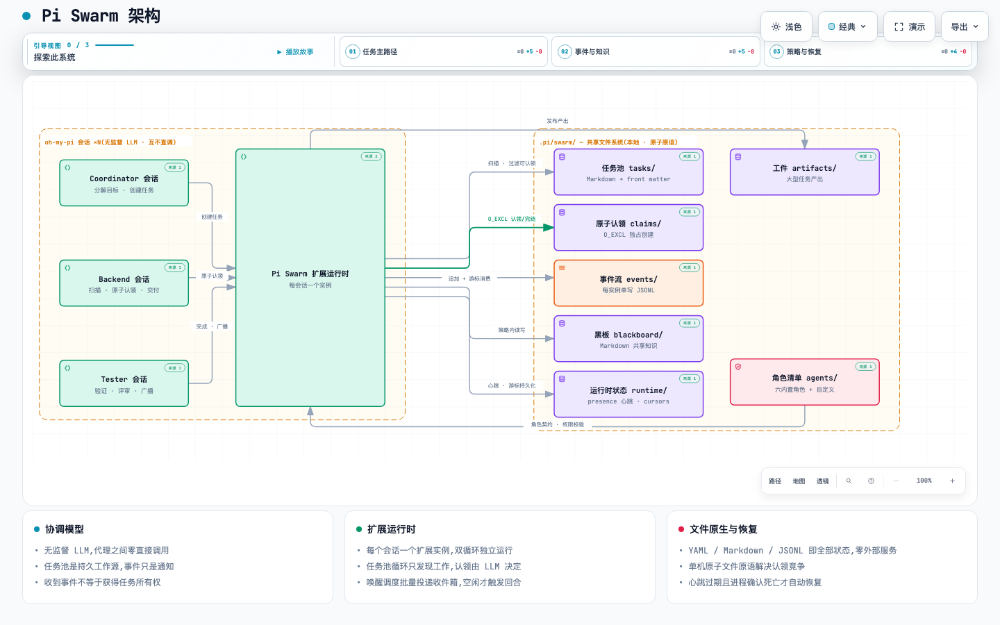

# Pi Swarm

**Pi Swarm** 是为 [oh-my-pi](https://oh-my-pi.dev) 打造的文件原生(file-native)多代理协调运行时:同一工作区内的多个独立 Pi 会话,通过共享拉取式任务池、原子文件认领、追加式 JSONL 事件流和 Markdown 黑板,以专职角色协作完成工作。没有监督 LLM,也没有代理之间的直接调用 —— 一切协调都发生在 `.pi/swarm/` 目录下的文件里。



> 🖥️ 交互版架构图(支持明暗主题、缩放、搜索、关系追踪与导出):[docs/architecture/pi-swarm-architecture.html](docs/architecture/pi-swarm-architecture.html)

## 核心特性

- **自治代理,零直接调用** —— 每个会话是自主的代理节点;代理之间不互相唤起进程、不寻址 PID/终端,一切协作经由共享文件。
- **拉取式任务池** —— 任务以 `open` 状态进入共享池,合格代理扫描、过滤、竞争认领;收到事件不等于获得任务所有权。
- **原子认领 = 唯一所有权事实** —— 认领基于 `O_EXCL` 独占创建 `claims/<TASK-ID>.yaml`;竞争失败返回 `already_claimed` 是正常流程。
- **单写者 JSONL 事件流** —— 每个实例只追加自己的流,消费方按字节游标 at-least-once 消费;事件只是通知,任务池才是持久工作源。
- **Markdown 黑板** —— 组织级共享知识(决策、发现、评审),按角色清单的读写 glob 策略做权限校验。
- **崩溃可恢复** —— 心跳过期且进程确认死亡才自动回收孤儿任务;`/swarm doctor` 与 `/swarm recover` 提供诊断与修复。
- **零外部服务** —— 不需要 SQLite / Redis / NATS;YAML、Markdown、JSONL 就是全部状态。

## 安装

克隆仓库后,以 oh-my-pi 扩展方式加载 —— 在 `~/.omp/agent/config.yml` 中添加:

```yaml
extensions:
  - /path/to/pi-swarm
```

或启动时一次性加载:

```sh
omp -e /path/to/pi-swarm
```

扩展入口是 `src/extension/index.ts`(见 `package.json` → `omp.extensions`),无需构建步骤。

## 快速开始

1. **初始化工作区**(创建 `.pi/swarm/`、默认配置与六个内置角色清单,从不覆盖已有文件):

   ```
   /swarm init
   ```

2. **在第一个 Pi 窗口绑定角色**:

   ```
   /swarm role coordinator
   ```

   协调者向你确认目标,并为其他角色创建 open 任务(`swarm_task_create`)。它自己从不认领任务,也从不直接唤起其他代理进程。

3. **在同一工作区的其他 Pi 窗口绑定更多角色**:

   ```
   /swarm role backend
   /swarm role tester
   ```

4. **发现并认领工作。** 每个代理列出可认领任务并原子认领 —— 竞争(`already_claimed`)是正常流程:

   ```
   swarm_task_list
   swarm_task_claim    { taskId: "TASK-0001" }
   swarm_task_start    { taskId: "TASK-0001", claimId: "CLM-..." }
   swarm_task_complete { taskId: "TASK-0001", claimId: "CLM-...", summary: "..." }
   ```

   代理之间用 `swarm_event_emit` 协调(定向 `toRole` 或按 `topic` 广播),在黑板上沉淀知识(`swarm_blackboard_read` / `swarm_blackboard_write`,按清单权限校验),用 `swarm_artifact_publish` 发布大块产出。`/swarm agents` 查看可用角色;新增自定义角色只需放入一个 `agents/<role>.yaml` 清单 —— 无需改代码。

## `/swarm` 命令

| 命令 | 用途 |
| --- | --- |
| `/swarm init` | 创建或修复工作区,安装默认角色清单 |
| `/swarm role <role>` | 将当前会话绑定到角色(重复活跃实例会被拒绝) |
| `/swarm status` | 已绑定角色/实例、运行时状态、任务计数、在线状态表 |
| `/swarm tasks` | 全部任务的状态、优先级、标题与认领者 |
| `/swarm agents` | 角色清单与活跃实例 |
| `/swarm recover [taskId]` | 扫描并对账 claim/task 漂移,回收孤儿任务 |
| `/swarm doctor` | 只读诊断(目录布局、清单、JSONL、游标、文件系统能力) |

## 领域工具(13 个)

| 任务生命周期 | 说明 |
| --- | --- |
| `swarm_task_list` | 列出任务(默认列出可认领与自己持有的) |
| `swarm_task_get` | 读取单个任务的元数据、依赖与正文 |
| `swarm_task_create` | 在共享池创建 open 任务(不授予所有权) |
| `swarm_task_claim` | 原子认领;竞争时返回 `already_claimed` |
| `swarm_task_start` | 认领任务转入 in_progress(需 `claimId`) |
| `swarm_task_complete` | 完成任务(done),可带摘要与产出引用 |
| `swarm_task_fail` | 以结构化原因标记失败 |
| `swarm_task_abandon` | 放弃持有任务,交由恢复流程 |
| `swarm_task_reopen` | 将 abandoned 任务重新打开 |

| 事件 · 黑板 · 工件 | 说明 |
| --- | --- |
| `swarm_event_emit` | 向自己的 JSONL 流发事件(`toRole` 定向或 `topic` 广播) |
| `swarm_blackboard_read` / `swarm_blackboard_write` | 按清单 glob 策略读/写黑板文档 |
| `swarm_artifact_publish` | 大块产出发布到 `artifacts/<taskId>/` 并发引用事件 |

## 工作原理

**任务状态机**

```text
open ──原子认领──▶ claimed ──显式 start──▶ in_progress ──▶ done | failed
 ▲                                              │
 └────── recovery / reopen ◀── abandoned ◀──────┘
```

**关键不变量**

1. 认领记录(`claims/`)是任务所有权的唯一事实;任务 Markdown 只是物化视图,对账器负责修复漂移。
2. 事件永远不授予所有权;漏掉事件不会让任务不可发现 —— 代理总会重扫任务池。
3. 每条事件流恰好一个写者;消费者各自持有游标,不完整的 JSONL 尾行不会被当作有效事件。
4. 任务变更要求持有当前 `claimId`;黑板的读写由扩展工具按清单强制执行,而非仅靠提示词。
5. 自动孤儿回收要求「心跳过期 且 进程确认死亡」双条件;活着但可疑的认领者只暴露、不自动回收。
6. 扩展重启后能从 `.pi/swarm/` 完整重建可行动的运行时状态。

**运行时双循环** —— 每个会话内嵌一个扩展实例:任务池循环扫描/过滤可认领任务;事件循环按游标消费各生产者流;两者汇入收件箱,由唤醒调度器批量投递 —— 仅在会话空闲时 `sendMessage` 触发回合,避免打扰进行中的工作。

## `.pi/swarm/` 目录

```text
.pi/swarm/
├── swarm.yaml          # 工作区配置
├── agents/             # 角色清单(角色、能力、订阅、黑板读写策略、唤醒条件)
├── tasks/              # 任务文档(Markdown + YAML front matter,持久工作源)
├── claims/             # 认领记录(所有权的唯一事实)
├── events/             # 每实例单写的追加式 JSONL 事件流
├── blackboard/         # 共享知识(project / architecture / decisions / findings / reviews)
├── artifacts/          # 任务大块产出
└── runtime/            # 本地协调状态(instances 心跳、cursors 游标)
```

## 故障排查

- **“Role X already has an active instance”** —— 另一个活跃 Pi 会话持有该角色(心跳新鲜且进程存活)。换个角色绑定,或停掉那个会话;崩溃重启的会话会依据会话历史自动重新绑定。
- **`/swarm doctor` 报错** —— 按分类给出修复建议:目录缺失(`/swarm init` 修复)、清单/任务非法、重复活跃实例、claim/task 漂移与孤儿认领(`/swarm recover`)、JSONL 截断、游标过期、文件系统原子创建能力。
- **任务没出现 / 事件丢了** —— 事件只是通知,不是工作来源;任务池是持久的,代理始终会重扫。
- **恢复** —— 认领者心跳过期且进程确认死亡的任务,可经 `/swarm recover` 置为 abandoned 并重新打开;活着但可疑的认领者只被呈现,绝不自动回收。

## 开发

```sh
pnpm install
pnpm typecheck   # tsc --noEmit
pnpm test        # vitest run(单元 / 集成 / 多进程并发认领)
```

## 设计文档

- [`pi-swarm-1.0/pi-swarm-1.0-architecture.md`](pi-swarm-1.0/pi-swarm-1.0-architecture.md) —— 架构、协议与不变量全量规范
- [`pi-swarm-1.0/pi-swarm-1.0-prd.md`](pi-swarm-1.0/pi-swarm-1.0-prd.md) —— 需求与测试计划
- [`docs/architecture/pi-swarm.architecture.json`](docs/architecture/pi-swarm.architecture.json) —— 架构图的 Archify 源规格(含仓库证据锚点)
